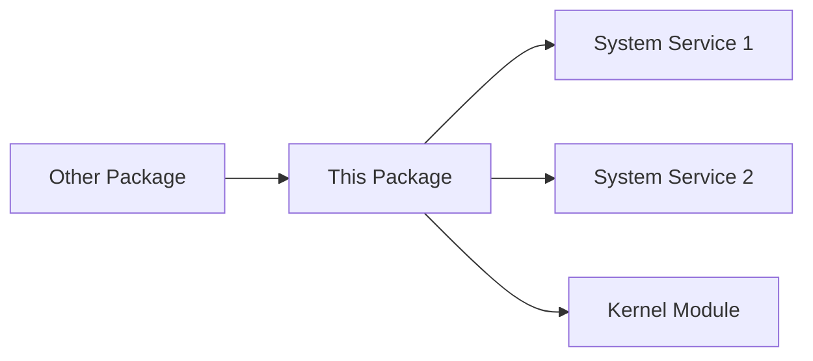

# [Package Name] - Package Analysis

[← Back to Package Index](../packages/index.md) | [← Previous Package](previous-package.md) | [→ Next Package](next-package.md)

---

> **Instructions**: Replace placeholders in square brackets with actual values. Remove this instruction block before finalizing.

## Package Identification & Metadata

### Basic Information
- **Package Name**: [Enter official package name]
- **Version**: [Specify package version, e.g., 1.2.3-4567]
- **Vendor/Author**: [Package creator/maintainer]
- **License**: [License type, e.g., GPL, Proprietary]
- **Release Date**: [Package release date]
- **Source**: [e.g., Synology official, third-party]
- **Package Manager ID**: [If applicable, e.g., com.synology.SafeAccess]

### Package Description
[Brief description of the package's primary purpose and functionality]

## Package Structure & Contents

### Installation Paths
```
Primary installation directory: [e.g., /var/packages/PackageName]
Binary location: [e.g., /usr/local/bin/package]
Configuration: [e.g., /etc/package.conf]
Data storage: [e.g., /var/lib/package]
```

### Directory Structure
```
/var/packages/[PackageName]/
├── INFO                    # Package metadata
├── PACKAGE_ICON.PNG       # Package icon
├── scripts/               # Installation/maintenance scripts
│   ├── preinstall
│   ├── postinstall
│   ├── preuninst
│   └── postuninst
├── target/                # Main package contents
│   ├── bin/              # Executable files
│   ├── lib/              # Libraries
│   ├── etc/              # Configuration templates
│   ├── ui/               # Web interface components
│   └── var/              # Variable data
└── conf/                  # Package configuration
    └── privilege         # Permission definitions
```

### Key Files and Components
| File/Directory | Purpose | Type |
|----------------|---------|------|
| [filename] | [What it does] | [Binary/Script/Config/Data] |
| [filename] | [What it does] | [Binary/Script/Config/Data] |

## Digital Signatures & Integrity

### Package Signature
- **Signed**: [Yes/No]
- **Signature Type**: [e.g., GPG, X.509]
- **Signing Authority**: [Certificate issuer]
- **Certificate Details**:
  - Issuer: [Certificate issuer DN]
  - Subject: [Certificate subject DN]
  - Valid From: [Start date]
  - Valid Until: [End date]
  - Fingerprint: [SHA256 fingerprint]

### File Integrity
| File | MD5 | SHA256 |
|------|-----|---------|
| [Critical binary] | [MD5 hash] | [SHA256 hash] |
| [Critical config] | [MD5 hash] | [SHA256 hash] |

### Verification Commands
```bash
# Package signature verification
[Command to verify package signature]

# File integrity check
[Commands to verify file checksums]
```

## Technologies Used

### Programming Languages
- **Primary Language**: [e.g., C++, Python, Go]
  - Evidence: [How identified - file command, strings, etc.]
  - Components: [Which parts use this language]
- **Secondary Languages**: [If applicable]
  - Evidence: [How identified]
  - Components: [Which parts use this language]

### Frameworks and Libraries
| Framework/Library | Version | Purpose | Components Using |
|-------------------|---------|---------|------------------|
| [Library name] | [Version] | [What it's used for] | [Which components] |
| [Framework name] | [Version] | [What it's used for] | [Which components] |

### External Dependencies
```bash
# System libraries (from ldd output)
[List of .so files]

# Python packages (if applicable)
[List from requirements.txt or pip]

# Node modules (if applicable)
[Key dependencies from package.json]
```

### Databases and Storage
- **Database Type**: [e.g., SQLite, PostgreSQL, None]
- **Location**: [Database file path]
- **Schema**: [Brief description or link to schema docs]
- **Data Types**: [What kind of data is stored]

## Core Functionality

### Primary Features
1. **[Feature Name]**
   - Description: [What it does]
   - Implementation: [How it works]
   - User Interface: [CLI/Web/API]

2. **[Feature Name]**
   - Description: [What it does]
   - Implementation: [How it works]
   - User Interface: [CLI/Web/API]

### Services and Daemons
| Service Name | Binary Path | Purpose | Auto-start |
|--------------|-------------|---------|------------|
| [Service] | [/path/to/binary] | [What it does] | [Yes/No] |
| [Daemon] | [/path/to/daemon] | [What it does] | [Yes/No] |

### User Interaction Points
- **Web Interface**: [URL path, e.g., http://router:8000/webman/3rdparty/package]
- **Command Line**: [Available commands and syntax]
- **API Endpoints**: [REST/RPC endpoints if any]
- **Configuration Files**: [User-editable configs]

## Package Dependencies

### Software Dependencies
```
Required packages:
- [Package name] >= [version]
- [Package name] == [specific version]

Optional packages:
- [Package name] (for feature X)
- [Package name] (for feature Y)
```

### System Dependencies
- **Kernel Modules**: [Required kernel modules]
- **System Services**: [Required running services]
- **Minimum DSM/SRM Version**: [Version requirement]
- **Architecture**: [Supported architectures]

### External Service Dependencies
- **Network Services**: [External services required]
- **Cloud Services**: [Any cloud dependencies]
- **License Servers**: [If applicable]

## Security Analysis

### Permissions and Access Control
```bash
# File permissions
[Output of ls -la for key files]

# Process privileges
[User/group the service runs as]

# Capability requirements
[Special capabilities needed]
```

### Network Security
| Port | Protocol | Purpose | Authentication | Encryption |
|------|----------|---------|----------------|------------|
| [Port] | [TCP/UDP] | [Service] | [Method] | [Yes/No/Optional] |

### Data Security
- **Sensitive Data Locations**:
  - [Path]: [Type of data] - [Encryption status]
  - [Path]: [Type of data] - [Encryption status]
- **Data Transmission**: [How data is transmitted]
- **Storage Encryption**: [Encryption methods used]
- **Access Logging**: [What is logged and where]

### Known Vulnerabilities
| CVE ID | Severity | Status | Description |
|--------|----------|--------|-------------|
| [CVE-YYYY-NNNNN] | [Critical/High/Medium/Low] | [Fixed/Open] | [Brief description] |

<!-- If no known vulnerabilities: -->
<!-- No known vulnerabilities identified at the time of analysis. -->

### Security Best Practices
1. **Configuration Hardening**:
   - [Recommendation 1]
   - [Recommendation 2]

2. **Access Control**:
   - [Recommendation 1]
   - [Recommendation 2]

3. **Monitoring**:
   - [What to monitor]
   - [Log files to watch]

### Potential Attack Vectors
- **[Vector Type]**: [Description and mitigation]
- **[Vector Type]**: [Description and mitigation]

## Configuration Management

### Configuration Files
| File Path | Purpose | Format | Reload Method |
|-----------|---------|--------|---------------|
| [/path/to/config] | [What it configures] | [JSON/XML/INI] | [How to reload] |

### Key Configuration Options
```
[Example configuration with annotations]
# Important setting 1
option1 = value1

# Security-related setting
option2 = value2
```

### Environment Variables
| Variable | Default | Purpose | Security Impact |
|----------|---------|---------|-----------------|
| [VAR_NAME] | [Default value] | [What it controls] | [Any risks] |

## Integration with SRM System

### System Hooks
- **Installation Hooks**: [What happens during install]
- **Startup Integration**: [How it starts with system]
- **Shutdown Procedures**: [Cleanup on shutdown]
- **Update Mechanisms**: [How updates are handled]

### Interactions with Other Components


### Resource Sharing
- **Shared Libraries**: [Libraries shared with system]
- **Shared Configurations**: [Config files used by multiple services]
- **Shared Data**: [Data directories accessed by others]

## Performance Considerations

### Resource Usage
- **CPU**: [Typical usage patterns]
- **Memory**: [RAM requirements and usage]
- **Disk I/O**: [Read/write patterns]
- **Network**: [Bandwidth requirements]

### Bottlenecks and Optimization
- **Known Bottlenecks**: [Performance limitations]
- **Optimization Options**: [Tunable parameters]
- **Caching**: [What is cached and where]

## Operational Notes

### Logging
| Log File | Purpose | Rotation | Important Entries |
|----------|---------|----------|-------------------|
| [/path/to/log] | [What it logs] | [Rotation policy] | [Key entries to monitor] |

### Maintenance Tasks
- **Regular Tasks**: [Scheduled maintenance]
- **Cleanup**: [Temporary files, old data]
- **Backup**: [What needs backing up]

### Troubleshooting
| Issue | Symptoms | Solution |
|-------|----------|----------|
| [Common issue 1] | [How it manifests] | [How to fix] |
| [Common issue 2] | [How it manifests] | [How to fix] |

### Useful Commands
```bash
# Check package status
[Command]

# View package logs
[Command]

# Restart package services
[Command]

# Verify package integrity
[Command]
```

## Legal and Compliance

### License Terms
[Summary of key license terms and restrictions]

### Export Restrictions
[Any export control considerations]

### Privacy Considerations
[Data collection and privacy implications]

## Cross-References
- Related packages: [Links to related package docs]
- System components: [Links to system docs this integrates with]
- Security reports: [Links to security analysis]
- Configuration guides: [Links to setup guides]

## Version History
| Version | Date | Changes | Security Updates |
|---------|------|---------|------------------|
| [Version] | [Date] | [Key changes] | [Security fixes] |

## Analysis Metadata
- **Analysis Date**: [Date of analysis]
- **Analyzed By**: [Your name/team]
- **SRM Version**: [Version analyzed on]
- **Tools Used**: Zen MCP with Gemini Pro
- **Limitations**: [Any analysis limitations or restrictions observed]

---

[← Back to Package Index](../packages/index.md) | [← Previous Package](previous-package.md) | [→ Next Package](next-package.md)

---
*This documentation was created as part of the comprehensive Synology SRM system analysis project.*